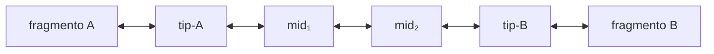
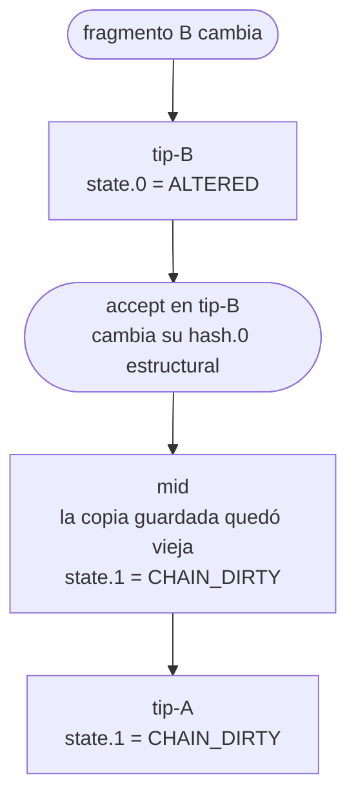

# Las cadenas

Un bilink conecta exactamente dos fragmentos estructurales. Hay dos formas: un link directo, con los dos endpoints en la misma capa y un solo archivo, y una cadena, donde los fragmentos están en capas distintas y el mismo UUID aparece en un archivo por capa, con endpoints relativos a su posición.

Una cadena es una secuencia lineal de bilinks que conecta dos fragmentos estructurales a través de las capas de un proyecto. Todos los bilinks de una cadena comparten el mismo UUID, que es simultáneamente su identificador de cadena y el nombre de su archivo.

## Topología

### Una cadena tiene dos tips y cero o más mids



Es el caso mínimo, dos tips y cero mids, cruzando una capa y su impl:


| Tipo de nodo | Endpoint 0 | Endpoint 1 | Posición en cadena |
|---|---|---|---|
| tip | estructural (`capture <id>`) | `path` | extremo (siempre dos por cadena) |
| mid | `path` | `path` | intermedio (cero o más) |

Restricciones de topología: exactamente dos tips por cadena; los tips tienen un endpoint estructural —una referencia a un capture de su propia capa— y uno `path`; los mids tienen ambos endpoints `path`; la cadena es estrictamente lineal, sin ciclos ni bifurcaciones; cada archivo `.bilink/<uuid>.yaml` en una capa pertenece a una sola cadena.

### El UUID identifica la cadena y localiza sus nodos

El UUID v4 es generado una sola vez al crear la cadena (`bilinker chain new`). En cualquier capa, el nodo de la cadena es `.bilink/<uuid>.yaml`.

No existe un archivo de registro central de cadenas: la cadena se descubre recorriendo los endpoints `path` desde cualquier nodo.

### La propagación está integrada en el formato

1. El `accepted` de un endpoint `path` es una copia del `accepted` del endpoint estructural del bilink adyacente —su `link` y su `hash`— y no el hash del archivo vecino.
2. Por eso refrescar la cache no propaga: los estados viven fuera del archivo, y un `accepted` sólo cambia con `accept`.
3. Si alguna de las dos copias ≠ la del nodo adyacente, el próximo `check` detecta `CHAIN_DIRTY`.



No se requiere índice externo para la propagación: la cadena es autosuficiente.

### El estado de la cadena es el peor de sus nodos

| Estado global | Condición |
|---|---|
| OK | Todos los nodos y fragmentos en estado OK |
| DIRTY | Algún nodo tiene CHAIN_DIRTY (propagación de cambio pendiente) |
| BROKEN | Algún nodo tiene estado terminal (ALTERED, DELETED, UNANCHORED, BROKEN) |

### Ciclo de vida

```
bilinker chain new   → crea los bilinks con el UUID, sin accepted
bilinker check       → resuelve captures y compara contra accepted → cache/state
bilinker accept      → escribe accepted con el estado actual
bilinker apply       → repunta link a la ubicación nueva; deja RELOCATED
bilinker chain status <uuid> → inspecciona cadena completa
```

## `bilinker chain new`

### Crea una cadena: un UUID y un bilink en cada capa

```
bilinker chain new --tip <STRATUM_PATH[:LINE:COL[,LINE:COL]...]> \
                   [--mid <STRATUM_PATH>]... \
                   --tip <STRATUM_PATH[:LINE:COL[,LINE:COL]...]> \
                   [--kind <valor>] [--name.0 <etiqueta>] [--name.1 <etiqueta>] \
                   [--as.N <modo>] [--dry-run] [--yes]
```

| Argumento | Descripción |
|---|---|
| `--tip <ref>` | Extremo de la cadena: path Stratum al archivo con una o más posiciones que caen en un mismo nodo, `abstract`, o `repo <alias>`. Exactamente dos veces. |
| `--mid <layer>` | Capa intermedia. Cero o más veces. |
| `--kind <valor>` | El [`kind`](bilink.md) del bilink. |
| `--name.N <etiqueta>` | El `name` del endpoint N. |
| `--as.N <modo>` | Qué partes del nodo señalado vigila el tip N, como [dimensiones](bilink.md) del endpoint. Sin esto, ninguna: el fragmento es el nodo entero. |
| `--as` | Sin valor: lista los modos disponibles y no hace nada más. |
| `--dry-run` | Muestra qué capturaría y no escribe nada. |
| `--yes` | No pregunta. Para scripts y para CI. |

Cada `--tip` captura el fragmento —sin posición, el archivo completo— y el endpoint queda apuntando a ese capture. Los mids llevan dos endpoints `path`. Ningún `accepted` se escribe: la cadena nace en `PENDING`.

Si un tip apunta a un fragmento ya capturado, el capture es literalmente el mismo archivo: el id sale de la ubicación.

```bash
bilinker chain new \
  --tip 'docs/specs/concepts/check.md:63:1' \
  --tip 'crates/bilinker/src/check.rs:405:1'
```

```
Created chain: 7f3d8e9a-1b2c-4d5e-8f6a-7b8c9d0e1f2a

  .bilink/7f3d8e9a-….yaml                    (tip)

Los dos endpoints quedan en PENDING. Revisar con `bilinker get` y aprobar con `bilinker accept`.
```

`--kind` existe para no depender de una edición a mano. `kind` y `name` son campos de declaración, y todo archivo de bilinker sale de un comando: sin el flag, la única forma de poblarlos sería abrir el YAML, que es justamente lo que el formato no pide de nadie.

### Las posiciones de un tip caen en un solo nodo

Las posiciones extra van separadas por coma, después de la primera:

```bash
bilinker chain new \
  --tip 'docs/specs/concepts/capture.md:66:1' \
  --tip 'crates/bilinker/src/query.rs:110:5,111:9'
```

Cada posición resuelve a su nodo igual que una sola —al ancla estable más cercana—, y todas tienen que caer en el mismo: señalar dos líneas de una función señala la función una vez. Es lo que pasa también al editar las marcas de la [vista previa](#y-las-marcas-se-editan).

Si caen en nodos distintos, `chain new` falla sin escribir nada. Dos nodos son dos contratos, y un capture es una ubicación: su query identifica un nodo y no compone el fragmento ([capture.md](capture.md)). Para vigilar partes de un nodo están las dimensiones, y las declara un generador con `--as`.

### El path de un tip atraviesa directorios, no sólo capas

Un tip se escribe con tokens Stratum, y los tokens de navegación entre capas —`>name`, `<`— se mezclan con componentes de path corrientes:

```bash
bilinker chain new \
  --tip 'subsystems/bilinker/concepts/capture.md:29:1' \
  --tip 'subsystems/bilinker>impl/crates/bilinker/src/capture.rs:523:1'
```

`subsystems/bilinker>impl` es un directorio común y después una capa. Es lo mismo que el formato acepta en un endpoint `path` —`path subsystems/bilinker>impl`—, así que el comando no agrega una forma nueva sino que alcanza la que ya existe.

### Los dos tips de la frontera

Una cadena que cruza a otro proyecto se crea desde cada lado por separado, y no podría ser de otra manera: son dos repos y ninguno escribe en el otro.

El proveedor publica una punta abierta:

```bash
bilinker chain new \
  --tip 'src/main/java/…/UserPermissions.java:42:1' \
  --tip abstract
```

Un solo archivo, en su repo, con `link: abstract` del lado 1. Nadie más aparece: el proveedor no sabe quién va a consumirlo.

El consumidor referencia ese bilink por su UUID, que es el mismo:

```bash
bilinker chain new --from-repo hsi:8a3f0d21 \
  --tip 'src/permissions.ts:17:1'
```

`--from-repo <alias>:<uuid>` toma el UUID del bilink remoto en vez de generar uno nuevo, y arma el endpoint `repo` del otro lado. Es la única forma de `chain new` que no genera UUID: la convención de UUID compartido es lo que hace el rendezvous, y generar uno propio rompería el vínculo antes de crearlo.

El alias tiene que estar declarado —`.bilink/.hsi.toml`— y el clon tiene que estar. `chain new` sí puede clonar, a diferencia de `check`: es un acto explícito de una persona que está creando un vínculo ([frontier.md](frontier.md)).

## `--as`: quién genera la query

### El modo se pide; no se adivina

Sin `--as`, el endpoint no declara dimensiones, y el fragmento es el nodo señalado entero. Con `--as <nombre>`, un generador declara qué partes del nodo se vigilan: `interface`, que es del núcleo, o un plugin como `spring-controller`. El capture es el mismo en los dos casos, porque lo escribe el núcleo.

Un generador sabe decir si tiene algo que decir sobre un nodo, y eso sirve para sugerir, nunca para elegir:

```
$ bilinker chain new --tip 'concepts/api.md:12:1' --tip '>impl/src/Ctl.java:16:5'
…
sugerencia: `--as.1 spring-controller` — el endpoint de Spring: la ruta compuesta, el tipo de retorno y los parámetros
```

Un generador que acierta cuando no querías ya te escribió otra cosa, y lo que un endpoint vigila no se ve sin ir a buscarlo. Bilinker arregla solo lo que es suyo, y pide lo que es del repo de otro.

Va por tip, con la misma forma que `--name.N`, porque los dos extremos rara vez se capturan igual: del lado de la spec hay una sección de markdown y del lado del código un método, y un modo global obligaría a que el modo del código valiera también para la prosa.

Un generador toma una posición, y declara las dimensiones de eso que señalaste.

### Por qué es un nombre y no una flag booleana

Porque hay más de uno. `--as` toma un nombre, y eso hace que el atajo del núcleo y el plugin se pidan igual: `--as interface` y `--as spring-controller` son la misma forma. Un `--interface` booleano habría dejado a los plugins como ciudadanos de segunda.

`--as` sin valor lista los que hay.

### El capture no deja rastro, y el bilink sí

Un generador declara dimensiones y desaparece. El capture que queda es el que el núcleo escribe para ese nodo: no dice quién lo pidió, no depende de que el generador exista, y es el mismo archivo que sale sin `--as`.

Eso lo fuerza el formato, no la disciplina. El id de un capture es `sha256(file \0 query \0)`; agregarle *"generado por spring-controller"* le cambiaría el id sin cambiar la ubicación. No hay dónde dejar el rastro aunque uno quisiera.

El bilink es otro objeto, y ahí sí hay dónde. Su id es un UUID y ya lleva campos que no entran en ningún hash, así que el endpoint anota con qué se capturó en [`as`](bilink.md), y lo que el generador decidió vigilar en [`dimensions`](bilink.md#las-dimensiones-parten-el-contenido-del-fragmento), cada una con su query escrita.

Y la mitad que importa se conserva entera: perder el plugin cuesta lo que el plugin sabía, nunca el vínculo. El capture sigue resolviendo, las dimensiones también —su query está en el endpoint y no se deduce del `as`—, `check` sigue contestando, y un `as` que nombra un generador que no está instalado es un dato que no se pudo usar.

### Y pasa la misma verificación que una query escrita a mano

El capture es el del núcleo, así que pasa la misma unicidad de la referencia que cualquier otro ([capture.md](capture.md), "Propiedades garantizadas de `capture`"). Y cada dimensión que el generador declara se resuelve antes de escribir, contra el nodo que el capture fijó: tiene que resolver, y a las partes que el generador señaló. Si no, `chain new` no escribe nada.

No es una regla nueva para generadores: es que no hay excepción. Una dimensión que vigila otra cosa reporta OK sobre una parte que nadie aprobó, y eso no cambia porque la haya escrito un plugin; cambia a peor, porque quien la pidió no vio la query.

### `--as interface`: la firma sin el cuerpo

El atajo del caso común. Señalás el método y el endpoint vigila su firma, una dimensión por parte:

```bash
bilinker chain new \
  --tip 'concepts/api.md:12:1' \
  --as.1 interface --tip '>impl/src/Service.java:16:5'
```

Sin el atajo, el endpoint vigila el método entero, cuerpo incluido, y un cambio en el cuerpo es un `ALTERED` sobre una spec que describe la firma.

### Lo que bilinker sabe, y es poco

Que en un nodo de función hay un campo que es el cuerpo, y que la firma es todo lo demás. En tree-sitter eso tiene nombre por gramática —`body` en Java, Rust y TypeScript—, y con eso alcanza: se declara una dimensión por cada hijo con nombre del nodo, menos ése.

Cada dimensión se llama como la gramática nombra a su hijo: por su campo —`type`, `name`, `parameters`— o, si no tiene campo, por su tipo de nodo —`modifiers`—. No hay tabla de nombres, porque salen del árbol, y en otro lenguaje son otros: `return_type` y `visibility_modifier` en Rust. Dos hijos sin campo del mismo tipo son una dimensión con dos partes.

La tabla que sí existe es la del cuerpo, de la misma clase que las anclas estables, y existe por lo mismo, para que un lenguaje que no está falle en vez de adivinar:

```
$ bilinker chain new --as.1 interface --tip 'spec.md:1:1' --tip 'script.py:10:1'
Error: `--as interface` no sabe qué es el cuerpo en python.
       Señalar las partes a mano, o agregar python a la tabla.
```

Un nodo sin cuerpo declara una dimensión por cada hijo. Si la gramática no le da campo `body` —la firma de un método en una `interface` de TypeScript—, la firma es el nodo entero.

Las partes son las que el nodo tiene al capturarlo. Un `throws` que aparece después no se vigila hasta que `recapture --as interface` lo declare.

### El nombre se captura y además ancla

La firma incluye el nombre, y el nombre es además lo que la query del capture usa para encontrar el nodo. Las dos cosas caen sobre el mismo nodo del AST, y cada una en su lugar: el predicado en el capture, y la parte en la dimensión `name` del endpoint.

```yaml
# capture
query: |-
  (class_declaration
    name: (identifier) @n0 (#eq? @n0 "Service")
    body: (class_body
    (method_declaration
    name: (identifier) @n1 (#eq? @n1 "getPermissions")) @target))
```

```yaml
# endpoint
    dimensions:
      modifiers:
        query: (method_declaration (modifiers) @target) @anchor
      name:
        query: '(method_declaration name: (_) @target) @anchor'
      parameters:
        query: '(method_declaration parameters: (_) @target) @anchor'
      type:
        query: '(method_declaration type: (_) @target) @anchor'
    as: interface
```

No es una redundancia que se pueda sacar. Sin la dimensión `name`, renombrar el método no sería un cambio de contenido sino una relocalización, y el fragmento aceptado dejaría de mencionar cómo se llama lo que describe.

Los hijos se nombran con `(_)` y no con su tipo de nodo: el tipo es parte de lo vigilado, y un `List<Dto>` que pasa a `Dto` es la firma que cambió, no una dimensión que desapareció.

### `--as spring-controller`: el endpoint, no el método

Señalás sólo el método y el plugin declara tres dimensiones:

```bash
bilinker chain new \
  --tip 'concepts/api.md:12:1' \
  --as.1 spring-controller --tip '>impl/src/HSIPublicApiUsersRestImpl.java:16:5'
```

- `route`: sube a la clase y toma el `@RequestMapping`, y baja al método y toma su anotación de ruta —`@GetMapping`, `@PostMapping`, …
- `type`: el tipo de retorno
- `parameters`: los parámetros

`type` y `parameters` son las de `--as interface`, con el mismo nombre y la misma query. `route` es la única que no es un hijo del método, y por eso lleva un nombre del generador. Con ella entra la ruta compuesta: sale de un `@RequestMapping` de clase más un `@GetMapping` de método, y el literal completo no aparece en ningún lado del archivo.

### El ancla es el nombre del método, y la ruta y el verbo son contenido

El capture es el del núcleo: el nombre de la clase y el del método. Lo que tiene que poder cambiar y verse —la ruta, el verbo y la forma— está en las dimensiones, y un cambio ahí es `ALTERED` con su diff, nunca un puntero perdido.

```yaml
    dimensions:
      parameters:
        query: '(method_declaration parameters: (_) @target) @anchor'
      route:
        query: |-
          (class_declaration
            (modifiers
              (_
                name: (identifier) @c (#match? @c "^(RequestMapping)$")) @target)
            body: (class_body
              (method_declaration
                (modifiers
                  (_
                    name: (identifier) @m (#match? @m "^(GetMapping|PostMapping|PutMapping|DeleteMapping|PatchMapping|RequestMapping)$")) @target)) @anchor))
      type:
        query: '(method_declaration type: (_) @target) @anchor'
    as: spring-controller
```

Cambiar el literal de la ruta, el verbo o el prefijo de la clase deja el endpoint `ALTERED(route)`, con su diff. Sacarle el literal a la anotación también. Cambiar un `List<Dto>` por un `Dto` lo deja `ALTERED(type)`.

- **Las anotaciones se reconocen por clase, no por nombre.** `#match?` contra el conjunto de anotaciones de ruta dice *"la anotación de ruta del método"*, sea `@GetMapping` o `@PostMapping`.
- **Los `@target` no fijan el kind.** `(_)` y no `annotation`: un `annotation` que pasa a `marker_annotation` es la ruta que cambió, no una dimensión que desapareció.
- **`route` pide lo que había al capturar.** Si la clase llevaba `@RequestMapping`, la query lo exige, y mudarlo al método deja el capture resuelto y `route` sin resolver: la salida es `recapture --as spring-controller`. Si no lo llevaba, la query nombra sólo la anotación del método, y un prefijo que aparece después no se vigila hasta volver a generarla.

El nombre del método no está en ninguna dimensión. Es el reparto inverso al de `--as interface`, y las dos reglas salen del mismo criterio —qué describe el fragmento—: una firma se describe por cómo se llama, y el contrato de un endpoint no incluye cómo se llama el método que lo sirve.

Lo que cuesta es lo de toda ancla: renombrar el método, o la clase, deja el capture sin ancla y el endpoint `UNRESOLVED`. Cuando la similitud lo encuentra sin ambigüedad el capture es `REANCHORED`: `apply` lo repunta y el endpoint queda `RELOCATED` hasta que alguien acepte. Entre hermanos parecidos la similitud no alcanza, el capture es `UNANCHORED`, y la salida es `recapture`. No hay ancla más barata: en un endpoint cuya anotación no lleva literal no hay otra cosa que lo distinga de sus hermanos, y anclar por algo que el endpoint vigila convierte el cambio que importa en un puntero perdido.

### En una sobrecarga, los tipos de los parámetros también anclan

Si el nombre del método se repite entre los métodos de la clase, el nombre solo no lo distingue, y la query del capture suma un predicado por el tipo de cada parámetro, en orden y sin huecos:

```
      parameters: (formal_parameters
        .
        (formal_parameter type: (_) @n2 (#match? @n2 "^Short$"))
        .
        (formal_parameter type: (_) @n3 (#match? @n3 "^List<Long>$"))
        .)
```

Es la regla del núcleo ([capture.md](capture.md)) y no del generador, así que el capture es el mismo con `--as` o sin él. Los tipos distinguen siempre: Java no compila dos métodos con el mismo nombre y los mismos tipos de parámetros. Los parámetros siguen siendo contenido —los vigila la dimensión `parameters`—, y lo que ancla es sólo el texto de cada tipo, no sus anotaciones ni sus nombres.

Van con `#match?` y no con `#eq?`, así que el último `#eq?` de la query sigue siendo el nombre del método.

Lo que cuesta es lo de toda ancla: cambiar el tipo de un parámetro de un método sobrecargado deja el capture sin resolver, y la salida es `recapture`. Cambiar su ruta sigue siendo contenido, y se ve como `ALTERED(route)` con su diff. Un método que no se repite en la clase ancla sólo en el nombre, como antes.

### El alias: el verbo y la ruta, compuestos del fragmento

Un bilink se identifica por su UUID, y para un endpoint hay un nombre que cualquiera reconoce. Está entero adentro de lo que se vigila, así que se compone y no se guarda:

```
GET /public-api/user/info/from-token
```

La ruta de clase y el literal del método son las dos partes de `route`; el verbo sale del nombre de la anotación —`@GetMapping` → `GET`—. No hay que ir a buscar nada afuera de las dimensiones.

Y en un markerless hace falta el nombre del método. Sin literal propio, la ruta de clase y el verbo los comparten todos los hermanos, así que el alias sería ambiguo. Lo desempata el nombre, que se lee del archivo entre las partes de `type` y de `parameters`: el tipo de retorno termina, viene el nombre, arrancan los parámetros, y en el medio no hay nada más.

```
GET /public-api/appointment/booking/institution  ·  getBookingList
```

Donde falta el literal sobra el nombre, y viceversa.

Se lee del archivo y no de la query del capture, aunque ahí esté. `name: (identifier)` aparece también en la clase, que va más arriba del árbol y por lo tanto antes en el patrón. Entre dos partes no hay ambigüedad posible: es la forma que la gramática le da al método, no una heurística sobre texto.

El alias es de cada generador y no del formato. Cada uno nombra en su vocabulario: acá es el verbo y la ruta porque eso es un endpoint; `--as interface` nombra por el método, con el texto de su dimensión `name`, porque eso es una firma. Un generador que no sepa nombrar no nombra, y el bilink se muestra por UUID. Tampoco nombra un endpoint cuyas dimensiones no resuelven: no hay de dónde componer.

Dónde vive el valor compuesto es de [la cache](cache.md), no de acá: es un derivado de las dimensiones, como `range` lo es del capture.

### El literal de ruta del alias es el posicional, el de `value` o el de `path`

El alias toma de cada anotación sólo su ruta: el primer argumento cuando es un string, o el valor de `value` o de `path`. `params`, `produces`, `consumes` y `headers` no son ruta, y una anotación que sólo los lleva no tiene literal propio: el alias se desempata con el nombre del método, como en un markerless.

```
GET jur/{idJurisdiccion}/us  ·  getMany
```

### Y bilinker no sabe de Spring

El plugin sí, y es todo lo que sabe: qué anotaciones marcan una ruta y dónde vive cada una. Está en un archivo, detrás del mismo trait que usa `interface`, y agregar otro framework es agregar otro archivo.

## La vista previa

### La salida deja ver qué se capturó, y qué no

Un endpoint es opaco después de escrito, así que una query mal generada se descubre tarde. Antes de escribir, `chain new` muestra cada tip que captura posiciones:

```
$ bilinker chain new --tip 'docs/spec.md:1:1' --tip 'src/Service.java:2:5'

. :: src/Service.java

     1   public class Service {
  ▸  2       public int uno(int a) {
  ▸  3           return a + 1;
  ▸  4       }
     5
     6       public int dos(int b) {
     ⋮

1 fragmento · 2–4
queda afuera: todo lo que no está marcado

¿escribir? [y/N/e(ditar)]
```

Cuatro cosas, y cada una atrapa un error distinto: el archivo como encabezado, una vez y no repetido por parte; contexto alrededor, con `⋮` donde se saltan líneas; `▸` sobre lo capturado, así lo que no entra se ve sin marcar; y una línea que dice qué quedó afuera, porque es lo que más se malinterpreta.

Con `--as`, lo marcado son las partes de sus dimensiones y no el nodo entero, y el pie las nombra: `3 dimensiones · parameters, route, type`.

El error que esto atrapa es señalar el nodo equivocado en un archivo con veinte parecidos: se ve porque la línea marcada queda lejos de donde tenía que estar.

Con `--dry-run` se muestra lo mismo y no se escribe nada, ni el capture ni el bilink. Con `--yes` no se pregunta.

Sin terminal tampoco se pregunta. Un `chain new` adentro de un script no puede quedarse esperando una tecla que nadie va a apretar; la vista se imprime igual, por stderr, y se escribe. La confirmación existe para la persona que está mirando, y `--yes` es cómo se dice eso explícitamente.

### Y las marcas se editan

Confirmar con `y/N` obliga a volver a empezar cuando la resolución agarró mal. `e` abre la misma vista en el editor, y ahí se corrige: se saca un `▸`, se pone otro, se guarda.

Las marcas son señales, no rangos. Cada línea marcada resuelve a su nodo, igual que una posición de la línea de comandos, así que editar el buffer es otra forma de señalar y lo que se guarda sigue siendo la query. Marcar tres líneas de una función marca la función una vez, y marcar dos funciones se rechaza, como dos posiciones que caen en nodos distintos.

Los dos tips van en un solo buffer. Abrir un editor por tip haría corregir a ciegas el segundo, y lo que se está revisando es el vínculo, no cada punta por su cuenta. Al guardar, la vista corregida se vuelve a mostrar: la corrección también se revisa.

Un buffer que vuelve sin ninguna marca no escribe nada: es la forma de abortar, la misma que `git commit` con un mensaje vacío.

El editor es el de git, resuelto con `git var GIT_EDITOR`: contesta lo que git realmente usaría, respetando `$GIT_EDITOR` → `core.editor` → `$VISUAL` → `$EDITOR` → el fallback del sistema. Es el mismo criterio por el que quién acepta sale de `git var GIT_AUTHOR_IDENT` y no de `user.name`. Si git no contesta, queda el `y/N`.

## `bilinker chain status` y `bilinker chain list`

### `bilinker chain status <uuid>` recorre todos los nodos

```
$ bilinker chain status 7f3d8e9a-1b2c-4d5e-8f6a-7b8c9d0e1f2a

Chain: 7f3d8e9a-1b2c-4d5e-8f6a-7b8c9d0e1f2a  [DIRTY]

  .bilink/                         (tip)   (OK, CHAIN_DIRTY)
    link.0  specs :: voting.yaml#impl       OK
    link.1  → .stratum/impl                CHAIN_DIRTY

  .stratum/impl/                   (tip)   (CHAIN_DIRTY, ALTERED)
    link.0  → spec layer                   CHAIN_DIRTY
    link.1  java-demo :: Persona#vote      ALTERED
              source: commit c7d3e9f "Inline comparator"
```

El estado global de la cadena es el de "El estado de la cadena es el peor de sus nodos".

### `bilinker chain list` lista las cadenas a partir del directorio actual

```
bilinker chain list [<texto>] [--as <modo>] [--link <tipo>] [--state <estado>] [--under <path>]
```

| Argumento | Filtra por |
|---|---|
| `<texto>` | que el alias lo contenga, sin distinguir mayúsculas |
| `--as <modo>` | con qué generador se capturó algún extremo: `spring-controller`, `interface` |
| `--link <tipo>` | qué clase de extremo tiene: `capture`, `path`, `issue`, `abstract`, `repo` |
| `--state <estado>` | el estado de la cadena: `ok`, `pendiente`, `dirty`, … |
| `--under <path>` | que algún extremo referencie un archivo bajo ese path |

```
$ bilinker chain list

7f3d8e9a  [DIRTY]   GET /public-api/user/info/from-token
3a4b5c6d  [OK]      GET /public-api/appointment/booking/institution  ·  getBookingList
f1e2d3c4  [BROKEN]  spec → impl
```

Cada cadena se nombra por su alias si alguno de sus extremos sabe nombrarse. Con 98 endpoints un listado de hexadecimales no distingue nada de nada, y encontrar uno obliga a sacar cada UUID y correrle `get`.

Y el que no tiene alias se muestra por UUID. Un extremo sin `as` no tiene generador que lo nombre. No es un error: es el estado de casi todo, y el listado tiene que seguir sirviendo ahí.

### Los filtros se combinan con Y

Un `chain list booking --state pendiente` es *las que se llaman así y están sin aceptar*; que se acumulen es lo que permite bajar de 98 a una sin salir del comando.

Una línea por cadena alcanza mientras haya diez. Con 98 —la superficie pública de un proveedor real— encontrar una obligaba a correr `get` uno por uno. En un repo propio el problema queda escondido, porque uno encuentra un bilink por el archivo que está editando, con `get <file>`. Del otro lado de la frontera nadie sabe qué archivo mirar.

### Los dos ejes de tipo no son el mismo, y por eso son dos flags

| eje | flag | valores | contesta |
|---|---|---|---|
| tipo del `link` | `--link` | `capture`, `path`, `issue`, `abstract`, `repo` | qué clase de extremo es |
| generador | `--as` | `spring-controller`, `interface`, ausente | con qué receta se capturó |

Son independientes: un `capture` puede tener cualquier `as` o ninguno, y un `abstract` no tiene ninguno porque no captura nada.

`--as` es el que hace útil un listado en un repo mezclado, donde conviven secciones de markdown, funciones de Rust y firmas capturadas con `interface`: pedir *"los `spring-controller`"* es pedir una clase de cosa, no un texto que aparezca en un nombre.

### Y `abstracts` sin alias es esto con `--link abstract`

| | qué lista | de dónde lo lee |
|---|---|---|
| `chain list --link abstract` | lo que esta capa publica | sus propios `.bilink/` |
| `abstracts` sin alias | lo mismo | ídem: es este comando con el filtro puesto |
| `abstracts <alias>` | lo que publica otro repo | el clon del proveedor, con `git show` y sin tocar el sparse |

La tercera fila contesta una pregunta que `chain list` no puede: mira el repo de otro ([frontier.md](frontier.md)).

El formato de cada uno sigue distinto porque las preguntas son distintas. `abstracts` trae el fragmento porque elegir de qué colgarse se decide leyendo el código; `chain list` trae el alias porque encontrar una entre 98 se hace por nombre.

### Código de salida de `chain`

| Código | Condición |
|---|---|
| 0 | Operación exitosa. |
| 1 | Error: UUID no encontrado, capa inválida, UUID duplicado en una capa. |

## `bilinker remove`

### Elimina el bilink de la capa actual

```
bilinker remove <uuid>
```

1. Resuelve `.bilink/<uuid>.yaml` en la capa actual, en el árbol o, si ya no está ahí, en la ref.
2. Elimina el archivo.
3. Commitea el borrado en `refs/bilink/<branch>`.
4. No elimina los captures que referenciaba: pueden estar en uso por otros bilinks. Un capture que queda sin referentes se limpia con `bilinker capture prune`.
5. Los nodos adyacentes de la cadena detectarán `BROKEN` en el próximo `check` y deberán decidir: reparar o también remover. La remoción se propaga hop a hop, no es automática.

```
removed: .bilink/7f3d8e9a-1b2c-4d5e-8f6a-7b8c9d0e1f2a.yaml
commit:  refs/bilink/… @ 4c1d9e0

note: nodos adyacentes detectarán BROKEN en el próximo check
note: 1 capture quedó sin referentes — `bilinker capture prune` para limpiarlo
```

### El borrado es un commit propio en la ref

Un commit de tipo decisión, de un padre, cuya primera línea es `remove <uuid>` ([ref.md](ref.md)). Su árbol es el del commit anterior de la ref menos ese bilink, y no el `.bilink/` del árbol de trabajo: otro cambio sin commitear en `.bilink/` no entra en el commit, y sigue en `bilinker diff`.

`bilinker push` lo publica como cualquier otra decisión. En una capa que todavía no cortó a la ref, `remove` sólo borra el archivo, y commitearlo es de quien trabaja.

### Un borrado que sólo está en el árbol se publica con el mismo `remove`

Si el bilink ya no está en el árbol y sigue en la ref —un borrado hecho con un binario anterior—, `remove <uuid>` commitea el borrado igual. Si no está en ninguno de los dos, es un error.

```
$ bilinker remove 35876ceb
removed: .bilink/35876ceb-7df1-4406-bb59-f61926c0267a.yaml  (ya no estaba en el árbol)
commit:  refs/bilink/… @ 7e21a3f
```

### `remove` es para lo que ya no tiene sentido

Para los estados `DELETED` y `BROKEN` donde el bilink ya no tiene sentido: el fragmento fue eliminado definitivamente, el repo fue removido, o el bilink fue creado por error. No es un sustituto de `bilinker accept`: si el fragmento cambió pero sigue siendo válido, corresponde `accept`.

| Código | Condición |
|---|---|
| 0 | Archivo eliminado. |
| 1 | UUID no encontrado. |
